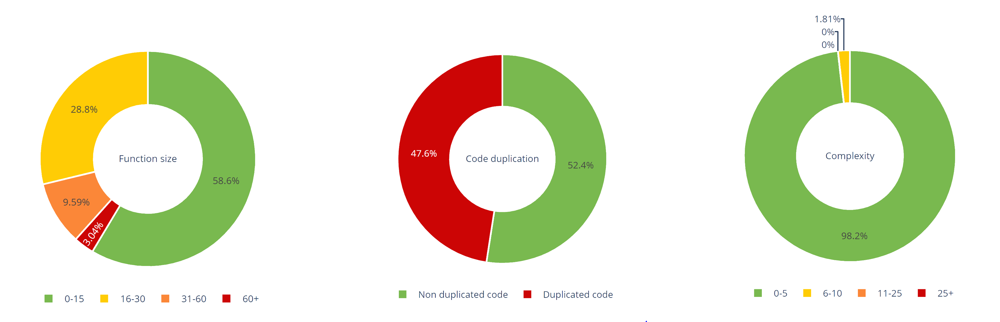

# SQATT

This repository contains scripts that are useful when analyzing software quality. These tools are inspired by the book
[Building Maintainable Software](https://www.softwareimprovementgroup.com/resources/ebook-building-maintainable-software/)
of the Software Improvement Group and the legacy code bases that I needed to comprehend. These tools are written in
python as I wanted to learn a new language.

It contains scripts to create profiles of specific quality aspects of a code base.

The scripts can create profiles for:

* code size
* complexity
* coding rule violations
* fan-in and fan-out
* function size
* interface size

These scripts use the output of tools like:

* [understand](https://scitools.com/)
* [resharper](https://www.jetbrains.com/resharper/)
* [cloc](https://github.com/AlDanial/cloc)
* [lizard](https://github.com/terryyin/lizard)
* [cpd](https://pmd.github.io/latest/pmd_userdocs_cpd.html)

Furthermore, there is a script to generate an include graph of a C/C++ code base.
