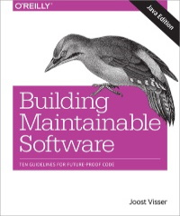
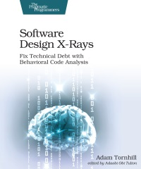
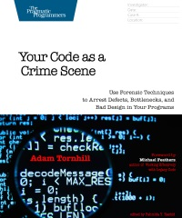
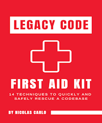

# SQATT

SQATT is a set of scripts to analyze the quality of a codebase.
These scripts create profiles of specific quality aspects of a code base.

The scripts can create profiles for the following quality aspects:

* the code size
* the complexity
* the code duplication
* the function size
* the interface size
* the comment to code ratio
* coding rule violations
* fan-in and fan-out

These scripts use the output of tools like:

* [resharper](https://www.jetbrains.com/resharper/)
* [cloc](https://github.com/AlDanial/cloc)
* [lizard](https://github.com/terryyin/lizard)
* [cpd](https://pmd.github.io/latest/pmd_userdocs_cpd.html)

The ideas for these scripts are based upon the books:

      
