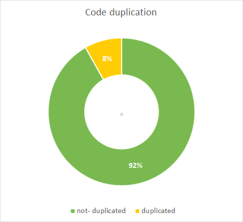

# Code duplication

### Guidelines

* One of the design principles is "DRY" (Don't Repeat Yourself). This implies that you do not copy code.
* Do this by writing reusable, generic code and/or calling existing methods instead.
* This improves maintainability because when code is copied, bugs need to be fixed at multiple places, which is inefficient and error-prone.

### Profile

The code duplication profile is divided into two categories:

* duplicated
* not duplicated

### Rating

Duplication is rated in 5 stars according to the following schema:

* 5 stars for 0-3% duplication
* 4 stars for 3-5% duplication
* 3 stars for 5-10% duplication
* 2 stars for 10-20% duplication
* 1 star  for 20-100% duplication

### Visualization

The profile is visualized in a donut.

