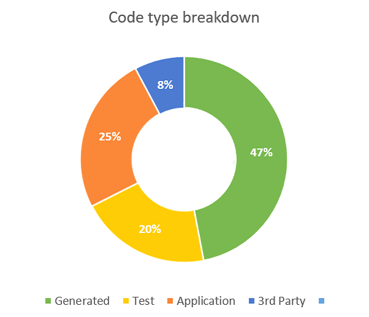

# Code type

To sketch the context it is interesting to know:

* how many lines of code is generated
* how many lines of code is from 3rd parties
* how many lines of code is test code
* how many lines of code is application code

These numbers make up a code type profile.

### Profile

The code type profile is divided into four categories:

* The number of lines of code that is generated
* The number of lines of code that is from 3rd parties
* The number of lines of code that is test code
* The number of lines of code for the application

### Rating

The code type profile does not have a rating. It is used to sketch the context.

### Visualisation

The code type profile is visualized in a donut.

