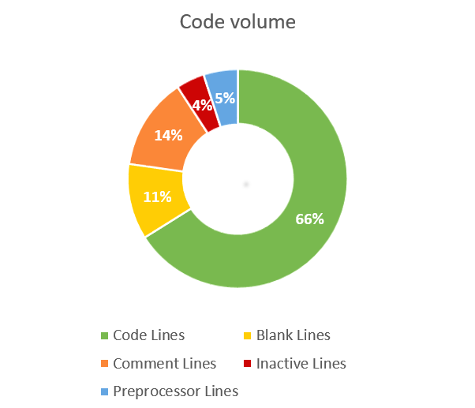

# Code volume

### Guidelines

* Keeping your codebase small improves maintainability, as it's less work to make structural changes in a smaller codebase.
* Avoid codebase growth by actively reducing system size.
* Refactor existing code to achieve the same functionality using less volume, and prefer libraries and frameworks over "homegrown" implementations of standard functionality.
* Strive to keep volume below 20 Man-years.

### Profile

The code base is classified as:

* small when it has at most 10000 lines of code
* moderate when it has more than 50000 lines of code
* large when it has more than  250000 lines of code
* huge when it has more than  3000000 lines of code

The code volume profile is divided into the categories:

* The number of lines of code
* The number of blank lines
* The number of comment lines
* The number of inactive lines
* The number of preprocessor lines

### Rating

The code volume has no rating. It is used to sketch the context.

### Visualisation

The code volume is visualized in a donut.
It shows the following metrics:
* The number of lines of code
* The number of blank lines
* The number of comment lines
* The number of inactive lines
* The number of preprocessor lines

The following metrics are visualized in a table:

* The number of files
* The number of functions
* The number of classes
* The profile