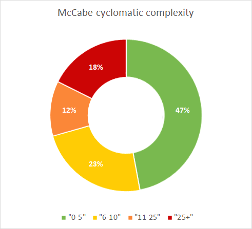

# Complexity

### Guidelines

* Limit the number of branch points per unit to 4.
* Do this by splitting complex units into simpler ones and avoiding complex units altogether.
* This improves maintainability because keeping the number of branch points low makes units easier to modify and test.

### Profile

The complexity profile is divided into four categories:

* a McCabe of at most 5
* a McCabe above 5
* a McCabe above 10
* a McCabe above 25

For each category the volume in terms of Lines of Code is calculated.
Example: 20% of the total lines of code has a McCabe Cyclomatic complexity above 10.

### Rating

Complexity is rated in 5 stars according to the following schema:

| Complexity | 5 Stars | 4 Stars | 3 Stars | 2 Stars | 1 Star |
|------------|---------|---------|---------|---------|--------|
| \> 25      | 0.5%    | 1.5%    | 3%      | 5%      | 8%     |
| \> 10      | 5%      | 10%     | 24%     | 40%     | 52%    |
| \> 5       | 17%     | 25%     | 45%     | 67%     | 75%    |
| <= 5       | 90%     | 75%     | 61%     | 46%     | 38%    | 

### Visualization

The profile is visualized in a donut.

