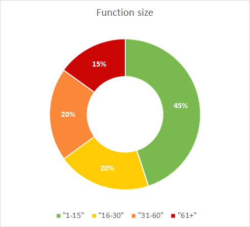

# Function size

### Guidelines

* Limit the length of code units to 15 lines of code. 
* Do this by not writing units that are longer than 15 lines of code in the first place, or by splitting long units into multiple smaller units until each unit has at most 15 lines of code. Use the refactoring techniques as described by Martin Fowler in his book [Refactoring, Improving the design of legacy code](https://martinfowler.com/books/refactoring.html)
* This improves maintainability because small units are easy to understand, easy to test, and easy to reuse.

### Profile

The function size profile is divided into four categories:

* at most 15 lines of code
* more than 15 lines of code
* more than 30 lines of code
* more than 60 lines of code

For each category the volume in terms of Lines of Code is calculated.
Example: 45% of the total lines of code resides in functions that are smaller than 15 lines.

### Rating

Function size is rated in 5 stars according to the following schema:

| Function Size | 5 Stars | 4 Stars | 3 Stars | 2 Stars | 1 Star |
|---------------|---------|---------|---------|---------|--------|
| \> 60         | 2%      | 7%      | 12%     | 15%     | 20%    |
| \> 30         | 15%     | 22%     | 31%     | 44%     | 52%    |
| \> 15         | 31%     | 44%     | 55%     | 67%     | 75%    |
| <= 15         | 80%     | 56%     | 41%     | 32%     | 25%    | 

### Visualisation

The profile is visualized in a donut.

