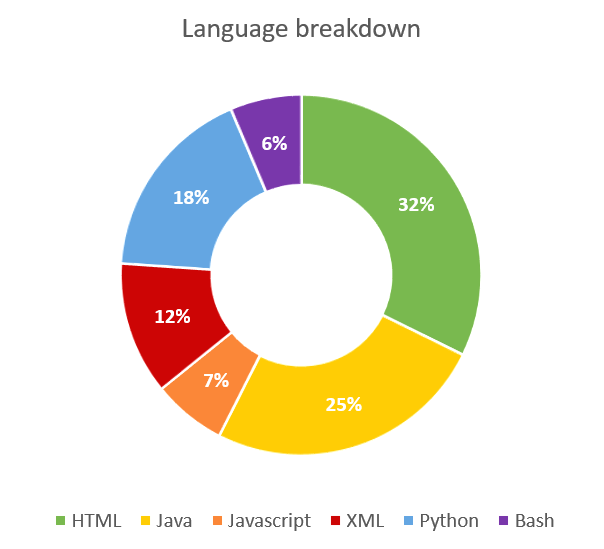

# Languages

### Guidelines

* Keep the number of different languages to a minimum. This improves the maintainability of the development environment and requires less knowledge of the developers.

### Profile

The language profile shows the lines of code per language that is used.

### Rating

The language profile does not have a rating. It is used to sketch the context.

### Visualisation

The language profile is visualized in a donut.

