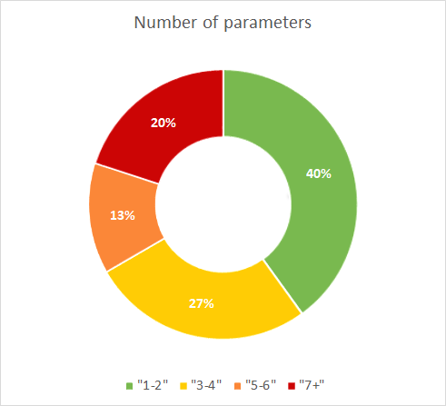

# Small interfaces

### Guidelines

* Limit the number of parameters per unit to at most 4.
* Do this by extracting parameters into objects.
* This improves maintainability because keeping the number of parameters low makes units easier to understand and reuse

### Profile

The function size profile is divided into four categories:
* 
* at most 2 parameters
* 3 or more parameters
* 5 or more parameters
* more than 7 parameters

For each category the volume in terms of Lines of Code is calculated.
Example: 45% of the total lines of code resides in functions that have fewer than 2 parameters

### Rating

Small interfaces is rated in 5 stars according to the following schema:

| Number of Parameters | 5 Stars | 4 Stars | 3 Stars | 2 Stars | 1 Star |
|----------------------|---------|---------|---------|---------|--------|
| \> 7                 | 0.3%    | 0.7%    | 2.3%    | 5%      | 8%     |
| \>= 5                | 1%      | 2.7%    | 5.4%    | 12.7%   | 22%    |
| \>= 3                | 6%      | 13.8%   | 27%     | 42.2%   | 65%    |
| \< 2                 | 95%     | 86.2%   | 75%     | 58%     | 46%    | 

### Visualisation

The profile is visualized in a donut.

