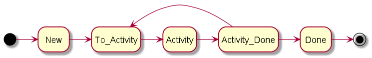

# Jira
This section describes the default configuration of Jira.
The configuration assumes an agile way of working.

## Issue types
The following issue types are defined:
* Epic
* User Story
* Task
* Sub-task
* Spike
* Technical Debt
* Bug

## Workflow
The workflow in Jira is configured according to the following principle.

Each issue starts in the state "New". From the state "New" a transition
is possible to the state "To_<Activity>". This state indicates that
the issue is ready for the <Activity> to be performed. When the activity
is started the issue transitions to the <Activity> state. In this state
the actual <Activity> is performed. When the <Activity> is finished the
issue transitions to the "<Activity_Done>" state. There it can be decided
if the issue needs another <Activity> or can transition to the state "Done".

The <Activity> is where projects can extend the workflow. There are a
few default activities defined:
* Analyzing
* Solving
* Reviewing
* Verifying
* Refining

Furthermore an issue can transition to the following states from any
other state:
* Blocked
* Dismissed

This configuration is suitable for different work flows in a project.
E.g. when a team need to refine an issue it can simply take all the issues
in the state "To_refining". When the issues are refined te issue will
transition to the state "To_solving", which means that it can be implemented
in one of the next sprints.

In a similar way it helps the CCB to select the issues that need to be
discussed.

A project can extend the workflow with new activities as long as it
complies with the pattern <To_Activity> -> <Activity> -> <Activity_Done>

## Roles
The following roles are configured in Jira:
* Administrators
* Developers
* Viewers

Each of these roles have different permissions in Jira.
The role permissions are described in the permission scheme sections.

## Permission schemes
Jira has several permission schemes
The following sections describe the configuration of each of the
permission schemes.

### Project permissions
This is the scheme for project permissions.

| Permission | Description | Role |
| --- |--- |---| 
| Administer Projects     | Ability to administer a project in Jira. | Administrators |
| Browse Projects         | Ability to browse projects and the issues within them. | Developers, Viewers |
| Edit Sprints            | Ability to edit sprint name and goal. | ??? |
| Manage Sprints          | Ability to manage sprints. | Administrators |
| Start/Complete Sprints  | Ability to start and complete sprints. | ??? |
| View Development Tools  | Allows users in a software project to view development-related information on the issue, such as commits, reviews and build information. | Developers, Viewers |
| View Read-Only Workflow | Users with this permission may view a read-only version of a workflow. | Developers, Viewers | 

### Issue permissions
This is the scheme for issue permissions.

| Permission | Description | Role |
| --- |--- |---| 
| Assignable User | Users with this permission may be assigned to issues. | Developers |
| Assign Issues   | Ability to assign issues to other people. | Developers |
| Close Issues | Ability to close issues. Often useful where your developers resolve issues, and a QA department closes them. | Developers |
| Create Issues | Ability to create issues. | Developers, Viewers |
| Delete Issues | Ability to delete issues. | Administrators |
| Edit Issues | Ability to edit issues. | Developers |
| Link Issues | Ability to link issues together and create linked issues. Only useful if issue linking is turned on. | Developers |
| Modify Reporter | Ability to modify the reporter when creating or editing an issue. | Administrators |
| Move Issues | Ability to move issues between projects or between workflows of the same project (if applicable). Note the user can only move issues to a project he or she has the create permission for. | Developers |
| Resolve Issues | Ability to resolve and reopen issues. This includes the ability to set a fix version. | Developers |
| Schedule Issues | Ability to view or edit an issue's due date. | Developers |
| Set Issue Security | Ability to set the level of security on an issue so that only people in that security level can see the issue. | Developers |
| Transition Issues | Ability to transition issues to a new state. | Developers |

